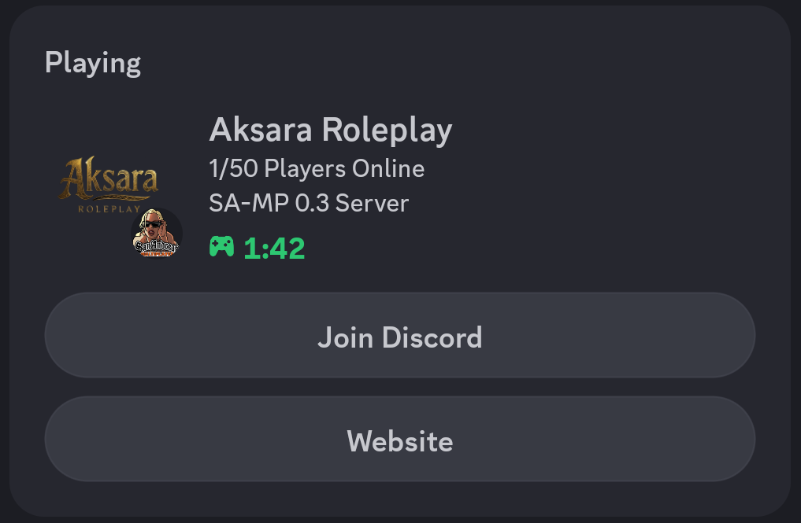

# 🎮 SAMP Discord Rich Presence (Customizable)
*A lightweight and fully customizable Discord RPC plugin for SA-MP.*

---

## 🇮🇩 Bahasa Indonesia

### 📝 Deskripsi
Plugin `.asi` ini memungkinkan Anda untuk menampilkan status aktivitas bermain GTA SA-MP di profil Discord secara otomatis. Plugin ini sangat fleksibel karena semua pengaturan (Gambar, Teks, Link Tombol, ClientID) bisa diubah melalui file `.ini` tanpa perlu koding ulang.

### ✨ Fitur Utama
* **Data Real-time**: Mengambil jumlah pemain (Players Online) langsung dari server.
* **Konfigurasi Eksternal**: Edit tampilan lewat `discord_rpc_settings.ini`.
* **Dua Tombol Interaktif**: Mendukung hingga 2 tombol link (misal: Discord & Website).
* **Fitur Filter**: Bisa diatur agar RPC hanya muncul di server tertentu (misal: Aksara saja) atau muncul di semua server.
* **Performa Ringan**: Berjalan di thread terpisah sehingga tidak mengurangi FPS game.

### 🚀 Cara Penggunaan
1. Unduh file `discord_rpc_settings.asi` dan `discord_rpc_settings.ini`.
2. Masukkan kedua file tersebut ke folder utama GTA San Andreas Anda (sefolder dengan `gta_sa.exe`).
3. Pastikan Anda sudah menginstal **ASI Loader**.
4. Jalankan game, dan status Discord Anda akan otomatis diperbarui.

---

## 🇺🇸 English

### 📝 Description
This `.asi` plugin allows you to automatically display your GTA SA-MP playing status on your Discord profile. It is highly customizable, allowing you to change images, text, button links, and ClientID via an `.ini` file without recompiling the code.

### ✨ Key Features
* **Real-time Data**: Fetches player count and max players directly from the server.
* **External Configuration**: Fully customizable via `discord_rpc_settings.ini`.
* **Dual Interactive Buttons**: Support for up to 2 clickable buttons (e.g., Discord & Website).
* **Smart Filtering**: Can be locked to specific servers or enabled for all servers.
* **Optimized Performance**: Runs on a separate thread to ensure 0% FPS impact.

### 🚀 How to Use
1. Download `discord_rpc_settings.asi` and `discord_rpc_settings.ini`.
2. Place both files into your GTA San Andreas root directory.
3. Make sure you have an **ASI Loader** installed.
4. Launch the game, and your Discord status will be updated automatically.

---

## ⚙️ Configuration (`discord_rpc_settings.ini`)

| Key | Description (ID) | Description (EN) |
|-----|------------------|------------------|
| **ClientID** | ID Aplikasi dari Discord Developer Portal | App ID from Discord Developer Portal |
| **LargeImageKey** | Nama asset gambar besar | Asset name for the large image |
| **SmallImageKey** | Nama asset gambar kecil (ikon) | Asset name for the small image |
| **ButtonLabel1** | Nama pada tombol pertama | Label for the first button |
| **DiscordURL1** | Link tujuan tombol pertama | URL for the first button |
| **ButtonLabe2** | Nama pada tombol kedua | Label for the second button |
| **DiscordURL2** | Link tujuan tombol kedua | URL for the second button |
| **EnableFilter** | 1 = Hanya server tertentu, 0 = Semua server | 1 = Specific server only, 0 = All servers |
| **FilterName** | Kata kunci nama server untuk filter | Keyword for the server name filter |

---

## 🏗️ Requirements
* **ASI Loader** ([e.g., Silent's ASI Loader](https://www.gtaall.com/gta-san-andreas/programs/135573-asi-loader-by-silent.html))
* **Discord Desktop App** (Logged in)

## ⚖️ License
This project is licensed under the [MIT License](LICENSE).

---
*Developed with ❤️ for the SA-MP Community.*
